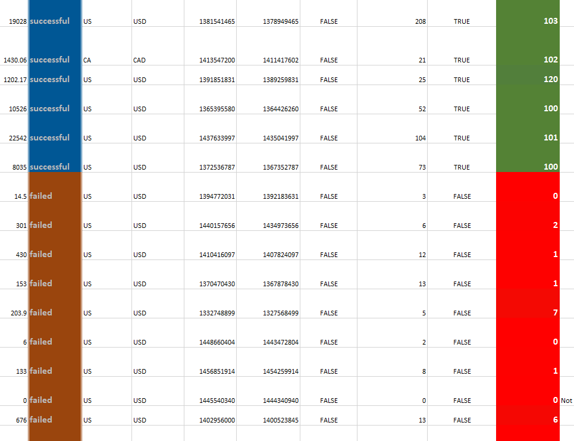
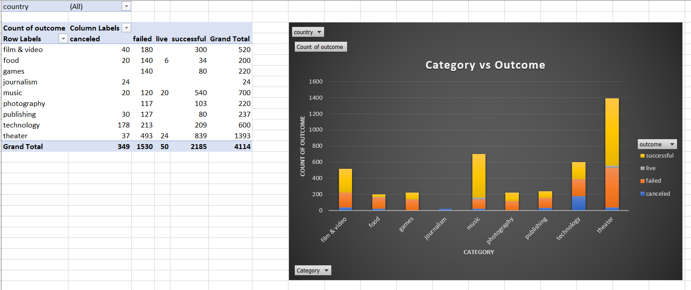
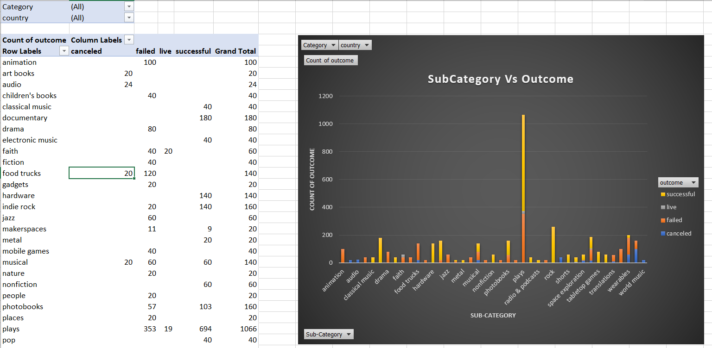
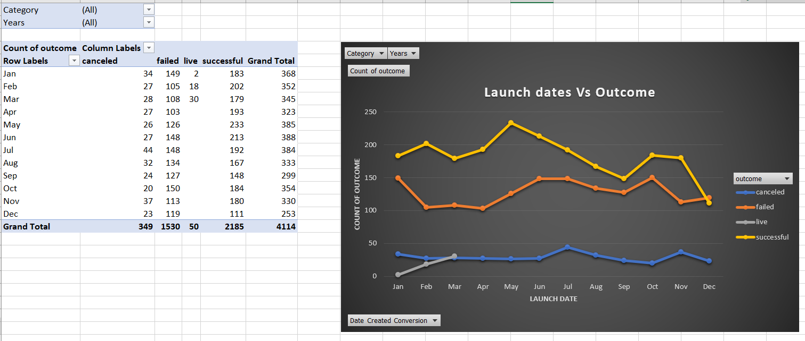
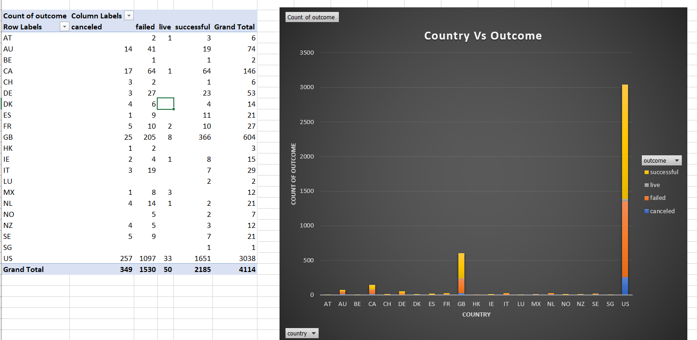

# Excel-Kickstarter-Projects-Analysis

# Objective
Modifying and analyzing the data of four thousand past Kickstarter projects as an attempt to uncover some of the market trends.

## Background
Of the over 300,000 projects launched on Kickstarter, only a third have made it through the funding process with a positive outcome. Since getting funded on Kickstarter requires meeting or exceeding the project's initial goal, many organizations spend months looking through past projects in an attempt to discover some trick to finding success. For this Analysis, I've organized and analyzed a database of four thousand past projects in order to uncover any hidden trends.

## Ms Excel features used:
* Conditional formatting
* Vlookups 
* Pivot tables 
* Pivot charts
* Line charts 
* Calculated Columns

